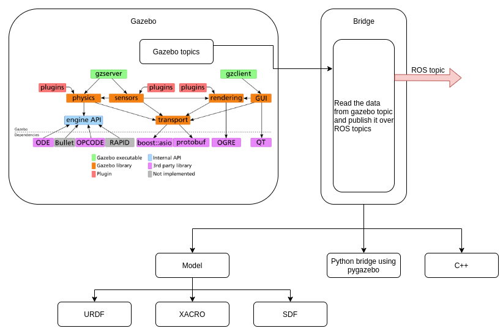

# Project: Gazebo Integration using API

<a href="https://www.repostatus.org/#wip"></a>


## Overview


---


## Concepts Used

Following are the concepts used for this project:

- **ROSlaunch API**
  - To import  the image using path
  - To import the image using camera
  - To set thresholds for Canny edge detection 
- **ROS tf**
  - To set the values of threshold parameters
  - To fetch the  values of threshold parameters


---


## Directory Structure

- Following is the directory structure of the package
  ```txt
  .
  ├── CMakeLists.txt
  ├── docs                             # README dependencies
  │   ├── tf.png
  │   └── tree.txt
  ├── include
  │   └── TurtleSim-tf
  ├── launch                           # Launch files
  │   ├── dynamic.launch                 # Launch - Multiple instance of same node using launch file
  │   └── spawn.launch                   # Launch - Multiple turtles in a turtlesim using launch file
  |
  ├── nodes                            # ROS Nodes
  │   ├── add_frame.py                   # Blueprint of a node - spawn random turtles and broadcast transform
  │   ├── pylaunch.py                    # Launch multiple instances using ROSlaunch API
  │   └── Turtle.py                      # Turtle class to control turtle activities
  ├── package.xml
  ├── README.md
  └── src
  ```
  


---


## Coding Style Guide - PEP8


---


## Dependencies

- `ROS-tf2`  package
- `turtlesim` package


---


## Setup and Run

To run the project on your local system, follow the procedure:

- Download the packages - `turtlesim-tf`

- Copy these packages to your ROS workspace i.e. `~/ROS_ws/src/`

- Build the work-space
  - `$ cd ~/ROS_ws/` 
  - `$ catkin_make`


### Using XML

File associated - `dynamic.launch` and `blueprint_node_launch.py`


### Using Python Script

File associated - `pylauncher.py` and `blueprint_node.py`


- Open new terminal and source the ROS workspace - `source ~/ROS_ws/devel/setup.bash`

- Run the command - `$ roslaunch turtlesim-tf xxxxxx.launch 5`

  - where 5 = number of turtle in a turtlesim

    > You can configure this number

- In a new terminal, run the command - `$ rqt_tf_tree` to display the `tf-tree`

  





---


## Future Work

- Import argument value as a ROS parameter from a launch file to a node in order to control assets associated with the node like topic name, transfer data, etc


---


## Article

[](https://medium.com/@shilpajbhalerao/lunar-explorer-d273cc5fe49e)


---


## Contact

[](https://www.linkedin.com/in/shilpaj-bhalerao/)[](https://github.com/Shilpaj1994) [](https://www.youtube.com/channel/UCucf49_Iau18mG5YFFCSpmw?view_as=subscriber)